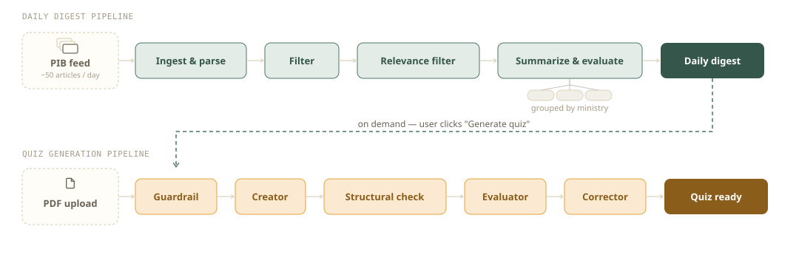

## Marginal

The project started out as a quiz generator from own PDF notes — UI to 
upload a document, get a quiz generated by Agents. 
From there it grew into a genuine tracking project: streaks, progress, weak topics. 
Then a current-affairs pipeline (real PIB releases, filtered and summarized daily), 
and most recently a RAG-based review feature that grounds its explanations in a
student's own uploaded material.

- **Quiz Creator** — PDF upload → AI-generated quiz, verified through
  a multi-agent pipeline (structural checks, safety checks, an
  evaluator that can send content back for correction) before it ever
  reaches a student.
- **Flashcards**
- **Quiz History**
- **Profile & Streaks**
- **Current Affairs** — a daily digest built from real PIB press
  releases, filtered and grouped by ministry. Every claim in the
  digest is grounded: generated with inline citation markers back to
  the specific source article it came from, rendered as clickable
  links directly in the digest text — nothing is asserted without a
  traceable source.
- **Topics to Preview** — once a student has enough wrong answers
  across their quizzes, a personalized review brief is generated,
  retrieving relevant passages from their own uploaded material and
  explaining what they missed. Each explanation carries a topic
  reference — the actual section/header of the source material it was
  grounded in — so a student can see exactly where to go back and
  read more, not just trust a generated answer.
- **Split PDF**

**References:**
- Mind Map Design Board: https://miro.com/app/board/uXjVG1qgOWM=/?share_link_id=810095261710
- Project Tracking: https://view.monday.com/5104126068-030e3dbf756cf1d8cf3239dccb945050?r=euc1&is_sharable_link=true
- Model Comparison Report: `model_comparison_report-1.pdf`
- `documentation/` folder for detailed pipeline documentation.

**Claude Usage:** used throughout for UI/UX design, template design,
code refining and debugging, production deployment, and Celery/Redis
setup. The architecture diagram is also generated via Claude.

## Architecture

**Stack:** Django + Postgres (with pgvector) for the core app and data
layer; Celery + Redis for background work, with Celery Beat handling
scheduled tasks (PIB polling, daily digest generation, stuck-quiz
cleanup); LangGraph for agentic orchestration, backed by a
Postgres-based checkpointer for resumability; LLMs accessed through
OpenRouter, with per-agent model selection (see Key Design Decisions);
MLflow for tracing, cost, and token tracking across every LLM call;
LlamaParse (primary) with Docling (fallback) for PDF extraction; and
plain Django templates with no frontend framework.

**How a request typically flows:**

1. A user-facing action (uploading a PDF, hitting a scheduled trigger)
   creates a database row and dispatches a Celery task.
2. The task runs the relevant pipeline: Quiz Generation, Daily Digest,
   or Topics to Preview (see Agentic Design). Two of the three use a
   LangGraph graph; Topics to Preview is a single agent call.
3. Source material gets chunked and embedded into `pgvector` as a side
   effect of quiz creation, independent of whether that specific quiz
   succeeds — this is what powers Topics to Preview's retrieval later.
4. Cost, token usage, and trace data are captured per node/agent and
   written to dedicated metrics tables, surfaced on the public
   dashboard.
5. The task updates the relevant model's status, and the frontend
   (polling or a redirect) reflects the result.

- **Live Dashboard** — full transparency into the system, public and
  always live: the pipeline architecture diagram, real per-agent cost
  and token breakdowns across all three pipelines, the digest's
  article funnel (ingested → filtered → included), self-correction
  rates (how often a first-pass result gets approved vs. corrected vs.
  exhausted), and real student rating data — not a marketing page,
  an honest, numbers-first look at how the system actually performs.

- **Flashcards** — generated directly from a quiz attempt's wrong
  answers rather than written by hand: each card carries the question,
  the correct answer, and its explanation, grouped by topic, with
  duplicate detection so retaking similar quizzes doesn't clutter a
  student's deck with repeats.

- **Study Mode** — A more focused view to go through the Flashcards 
  will be adding the spaced repetition logic to improve the User experience.
  Currently on the backlog.

## Agentic Design

The quiz-generation, current-affairs digest, and topics-to-preview pipelines 
— nodes, routing, why they're shaped the way they are.

### Quiz Generation Pipeline

The agentic design pipeline behind the Quiz Generation

**Flow:**
Guardrail → Creator → Structural Check → Safety Check → Evaluator →
(Corrector, if needed) → done

**Agents:**
- **Guardrail** performs a two-stage check. First, a cheap OpenAI
  moderation pre-check runs on the combined `description` +
  `tips_for_quiz_creation` text; a flag here ends the workflow
  immediately, categorized as `profanity`. If that passes, a more
  comprehensive LLM-based check verifies both the user's inputs *and*
  the uploaded source content together. Either stage failing ends the
  run — no retry within the graph. Instead, the user is redirected to
  the quiz-creation form to revise and resubmit: prior fields are
  pre-filled for convenience, except `description` and
  `tips_for_quiz_creation`, which are deliberately cleared whenever the
  failure category (`off_topic`, `manipulative`, `injection`,
  `profanity`) suggests the user's own input was actually at fault.
  `inappropriate_source` (a bad uploaded document, not bad text) leaves
  both fields intact, since they were never at fault.

- **Creator** generates the quiz from the source content and the
  user's instructions/choices. A separate prompt is defined per exam
  choice, so the generated questions genuinely adhere to that specific
  exam's style and conventions, rather than one generic prompt applied
  uniformly across every exam type.

- **Structural Check** verifies the generated quiz's structural
  integrity — checking for things like leaked reasoning, number of questions generated, 
  embedded newlines, and similar formatting issues (a plain code check, no LLM
  call). Retries via Creator up to 2 attempts before failing hard.

- **Safety Check** verifies the generated quiz is safe to present to
  the user, and that its tone genuinely matches the source content.
  Unlike Structural Check, there's no retry path — a failure here ends
  the run immediately.

- **Evaluator** runs after Safety Check clears, judging the generated
  quiz against several criteria: does difficulty match what was
  requested, are explanations genuinely grounded in the source
  material, are questions contextually valid, and are there any
  duplicate questions. When something fails, Evaluator doesn't just
  reject wholesale — it records the specific question index alongside
  a note on the issue. Feedback with no index (a whole-quiz problem)
  routes back to **Creator** for full regeneration; feedback tied to
  specific indices routes to **Corrector**, which fixes only those
  questions before Evaluator rechecks. Approval, or 2 exhausted
  attempts, ends the run.

- **Corrector** takes the specific question-indexed feedback from
  Evaluator and fixes only those questions, leaving the rest of the
  quiz untouched. The corrected quiz goes back to Evaluator, which runs
  the exact same evaluation again — checking whether the corrector fix 
  actually resolved the issue.

**Recovery paths:**
- **`FAILED_EXHAUSTED`** (retries are genuinely exhausted, quiz never approved) →
  "Try Again" — a fresh graph run from scratch, reusing the same
  source text, but new `thread_id`.
- **`FAILED_API_ERROR`** (a genuine crash — timeout or exception mid-run) →
  "Resume" — continues from the *exact* point of failure, using
  LangGraph's Postgres checkpointer and the original `thread_id`,
  rather than starting over. Only works when a real checkpoint exists
  to resume from.

All three entry points (fresh creation, retry, resume) share the same
finalization logic — writing cost/trace metrics and persisting
questions on approval.

**Extraction:** LlamaParse (`cost_effective` tier) first, Docling as an
automatic fallback if LlamaParse fails for any reason — both tested against real, 
pdf documents before finalizing.

### Digest Generation Pipeline

The agentic design pipeline behind the Daily Digest Generation

**Flow:**
Filter → Relevance Filter → Summarize & Evaluate (map-reduce, per ministry) → done

**Agents:**
- **Filter** screens every article's *title* (not full text — a
  cheap, fast first pass) for distressing content — violence, assault,
  abuse, and similar. This matters specifically because the source
  feed includes NHRC releases mixed in among the routine,
  informative government announcements, and that kind of content isn't
  appropriate for a study digest. For each article, it returns an
  include/exclude decision along with the reasoning behind it.

- **Relevance Filter** wasn't part of the original design, it was
  added once it became clear Filter's job (screening for distressing
  content) was a genuinely different concern from *exam relevance*
  (is this article actually worth including in a UPSC-focused digest
  at all). Rather than overloading Filter — which was already doing
  well, returning complex, well-reasoned structured output for its one
  job — a separate agent was introduced specifically for relevance.
  This also solved a real cost problem: with 50-60 articles arriving
  most days, summarizing and evaluating everything regardless of relevance 
  made costs climb quickly. Filtering out the genuinely irrelevant articles 
  first keeps the digest focused and keeps generation cost in check.

- **Summarize & Evaluate** started as a single Summary agent and a
  single Evaluator agent, each producing rich structured output — per-
  article decisions with reasoning, comprehensive evaluation feedback
  for the Summary agent to correct against. At the full daily volume
  (all surviving articles summarized in one call), this broke down
  badly: cost climbed to roughly $0.30 per run, and the approach failed
  significantly regardless of which LLM was tried.

  The fix was restructuring around **map-reduce**: articles are first
  grouped by issuing ministry, then each ministry's group is
  summarized and evaluated **independently**, with its own retry loop
  (up to 2 retries) rather than one shared, monolithic attempt. This
  dropped cost to roughly $0.12-0.13 per run and meaningfully improved
  reliability — a failure in one ministry's group no longer risks the
  whole digest, and each group's prompt is small enough to stay
  focused and accurate.

  **Crash isolation:** each group's cycle runs inside its own
  try/except — if a group crashes outright (not just fails evaluation,
  but genuinely errors), it's caught, logged with its specific error,
  and excluded, while every other group's work is preserved. A
  `run_log` records exactly which ministries were approved, rejected,
  or crashed, and why — useful for review after the fact.

- **Retry mechanism:** within each ministry's independent cycle,
  Evaluator's specific accuracy issues (tied to article IDs, with
  reasoning) feed directly back into the next Summary attempt's
  prompt as feedback — the same "regenerate with the evaluator's own
  critique in hand" pattern used in the Quiz Generation pipeline,
  just scoped to one ministry's small group rather than a separate
  Corrector node. After 2 retries, a still-rejected group is excluded
  from the digest rather than forced through.

- **Downstream:** an approved digest can be turned into a quiz on
  demand — the first user to click "Generate quiz" triggers
  `generate_quiz_from_text_task` using the digest's content directly as
  source text; the resulting quiz is then shared, so subsequent users
  don't regenerate it.

### Topics to Preview Pipeline

Built partly to help students review what they got wrong, and partly
as the proving ground for this project's RAG infrastructure — no
LangGraph graph here, just a single agent call, given the task doesn't
need multi-step routing or a separate Evaluator.

**Flow:**
For each of a user's wrong answers (capped at 15 per brief, oldest
first — a current, deliberate limit while this pipeline is still being
tested), retrieve the top 5 relevant chunks using a combined query —
the question text *and* its source citation together — against that
user's own stored `SourceChunk` embeddings. The agent then generates
one brief covering all 15: summarizing the relevant content for each
question and producing an answer, grounded in what was retrieved.

**Topic references:** each answer is paired with the ministry/section
headers of the chunks it drew from. These headers are captured and
stored directly at generation time (not looked up live from
`SourceChunk` afterward), so a brief stays fully self-contained and
correct even if the underlying chunks are later deleted or
regenerated. Displayed on the brief UI as the source reference for
each answer.

**No separate Evaluator:** the source content is already verified and
genuine (it's the same source text already vetted for quiz generation),
and the task itself — fetch relevant chunks, summarize them — is
comparatively simple next to the other two pipelines. Worth
reconsidering an Evaluator step later if real usage reveals a need for
one; not ruled out completely.

## Key Design Decisions

### Infrastructure: self-hosted inference → OpenRouter

Before settling on OpenRouter, several self-hosted inference paths
were tried, in roughly this order:

**Ollama, local.** Gemma 4:12b and Llama 3:8b were tried locally as
Creator/Evaluator candidates.

**RunPod GPU servers.** The same setup was replicated on a RunPod
A40, which hit a CPU bottleneck. Switching to an RTX 3090 confirmed
CPU was genuinely the limiting factor — generation time improved
significantly, but was still around 10 minutes, far from ideal.
Digging further, the real bottleneck turned out to be Gemma's own
"thinking" overhead; disabling it didn't meaningfully help.

**vLLM.** Appealing for its ability to scale to multiple concurrent
users, so it was tried next. But finding and testing the right models
locally was genuinely difficult on a Mac before deploying the same
setup to production — by this point, most of the available time and
money had gone into debugging RunPod issues, with no prior deployment
experience to draw on (Claude and web searches were the main resources
used throughout). With cost accumulating the whole time, this stopped
looking like a viable path.

**Serverless GPU endpoints.** Pay-as-you-go seemed like a natural fit
next. The real problem turned out to be cold-boot vs. warm-boot
behavior: a cold-booted request took as long as boot time *plus*
generation time combined, while a warm one was fast — but keeping the
endpoint warm to avoid this meant paying close to the same as just
owning a GPU outright, defeating the point. Modal and Cerebrium were
tried next, on the premise (from research) that they handled boot
times better than RunPod, and their free tiers looked promising.
Cerebrium hit an internal packaging issue unrelated to the project
itself, blocking deployment. Modal deployed successfully, but showed
the same cold/warm boot pattern with no meaningful improvement in
generation time.

**OpenRouter.** Found after all of the above. Removed the need to
manage models or infrastructure directly, and made it genuinely easy
to test and compare many different models — which is what actually
made the model-selection process documented above possible in the
first place. Paired with Railway for hosting the application itself.

Only after the quiz-generation pipeline was working on this
infrastructure did the gaps that led to Guardrail, Structural Check,
Safety Check, and the rest of the surrounding agents get identified
and added.

### Extraction: Docling → LlamaParse

Quiz generation originally extracted PDF text using Docling, which
handled table extraction meaningfully better than alternatives tried
(pdfplumber, pymupdf). But while building the RAG chunking pipeline,
repeated passes through Docling's markdown output revealed the
headers weren't consistently well-formed — and this directly hurt
retrieval, surfacing irrelevant chunks when a header failed to line up
correctly with its actual content.

Switching to LlamaParse fixed this — its extracted markdown was
noticeably cleaner and more consistently structured than Docling's,
resolving the retrieval-quality problem directly.

**Tier selection:** the first attempt used LlamaParse's Agent tier,
which burned through credits quickly across just a couple of runs.
The `cost_effective` and `fast` tiers were tested directly against the
same real documents and the output quality is compared, `cost_effective`
tier matched the Agent tier's output closely, at meaningfully lower cost,
and was adopted as the default. Docling remains as an automatic
fallback if LlamaParse fails for any reason.

### Model selection: Quiz Generation Pipeline

Each agent's model was chosen through direct, head-to-head testing
against the same real source document — not from benchmarks or
assumptions. Full comparison methodology and data live in
`model_comparison_report.pdf`; summarized below.

**Creator — DeepSeek V4 Flash.** Nine models were tested generating a
full 20-question quiz from the same real, Docling-extracted source
document, with every question individually checked against the source.

The most important finding: **Grok 4.3 had a systematic accuracy bug,
not random noise** — in exactly 10 of 20 questions, both statements
were actually true per the source, but Grok's own answer key
consistently selected "2 only" instead of "Both 1 and 2." A repeatable
bias, not scattered error — disqualifying on its own. GPT-5.4 Nano had
one isolated error of the same type, not a repeating pattern.

DeepSeek V4 Flash was the only model with **every one of its 20
questions individually verified correct** (not just spot-checked), at
$0.0027 for the run — among the cheapest options tested, with the
strongest verification behind it. Gemini 2.5 Flash-Lite was faster and
similarly cheap with a clean spot-check, but DeepSeek's full
verification made it the more trustworthy choice for the agent
actually generating the content.

**Evaluator — Gemini 3.7 Flash.** Chosen for robustness specifically
at *catching* Creator's errors — other models tested missed mistakes
that Gemini 3.7 Flash reliably caught.

**Guardrail — GPT-5.4 Nano.** Paired with OpenAI's own moderation API
as a natural fit; tested directly against flagged/manipulative user
inputs and source content, and performed reliably.

**Safety Check & Corrector — DeepSeek V4 Pro.** Both tasks involve
close parsing of the already-generated quiz (verifying tone/safety,
or applying targeted fixes) — DeepSeek V4 Pro performed well on both.

### Model selection: Daily Digest Pipeline

**Filter & Relevance Filter — GPT-5.4 Nano.** Both are lightweight
classification tasks (include/exclude decisions on article titles) —
same reasoning as Guardrail in the Quiz Generation pipeline: opted for a cheap,
fast model.

**Group Summary — Gemini 2.5 Flash-Lite.** Several models were tested
here — DeepSeek V4 Flash, GPT-5.4 Nano/Mini, GLM Flash, among others — but
Gemini 2.5 Flash-Lite stood out specifically for accurate digest
generation with structured output, and was chosen on that basis.

**Group Evaluator — Gemini 3.7 Flash.** Same model, same reasoning as
the Quiz Generation pipeline's Evaluator — tested directly and
verified reliably, chosen on that basis.

### Model selection: Topics to Preview Pipeline

**Agent — Gemini 2.5 Flash-Lite.** Reused directly from the Daily
Digest pipeline's Group Summary choice, given the task is similar in
shape — grounded synthesis from retrieved source content into
structured output. Verified it performed well for this pipeline too,
and finalized on that basis rather than running a fresh, independent
comparison.

## Setup

1. Clone the repo, create a virtualenv, `pip install -r requirements.txt`.
2. Set up Postgres with the `pgvector` extension enabled
   (`CREATE EXTENSION IF NOT EXISTS vector;`), and Redis for Celery.
3. Copy `.env.example` (or set directly) — needs OpenRouter and OpenAI
   API keys, LlamaParse credentials, DB connection details, and an
   MLflow tracking URI. Bucket storage (AWS) vars are production-only;
   local dev uses plain disk.
4. `python manage.py migrate`, then `python manage.py runserver`.
5. Run the worker: `celery -A personalmanager worker --beat --loglevel=info --concurrency=2`.

## Future Roadmap

- **Multi-document upload and topic consolidation** — a Wikipedia-
  style approach: once a user can upload several documents on the same
  subject, group together the content that's actually about the same
  topic or event across those documents (even when different sources
  phrase it differently), and combine it into one clear page per
  topic — rather than leaving students to piece it together themselves
  across scattered material. Early exploration, being tested in a 
  separate setup before bringing into this project.
- Doubt-resolution chat, grounded in a user's own uploaded material.
- Flashcard deck sharing.
- About Us page.
- SM-2 spaced repetition for flashcards.